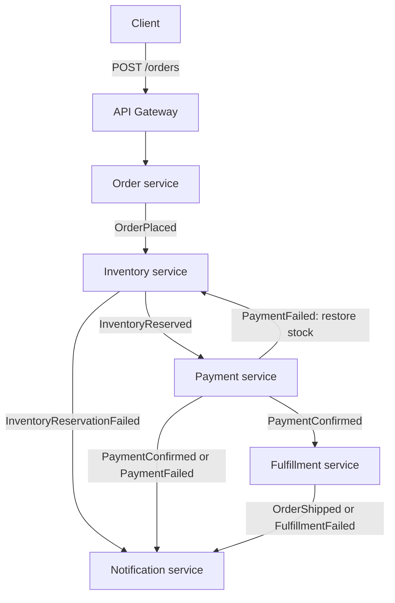

# Order Fulfillment System

This is an event-driven order fulfillment system built with Python on AWS, provisioned with Terraform. It uses a choreography-based saga pattern, as there is no central orchestrator and each service reacts to events and publishes the next one in the chain. A transactional outbox pattern is used by leveraging DynamoDB transactions to ensure event delivery stays consistent with database writes. Idempotency is enforced with conditional DynamoDB writes, with a dedicated tracking table where a service's schema does not directly support it. Payment, Fulfillment, and Notification services are simulated for simplicity.

## Technologies Used

**Language**: Python  
**AWS**: Lambda, SQS with dead-letter queues, EventBridge, IAM roles and policies for Lambda execution, DynamoDB with Streams and transactions, API Gateway  
**Infrastructure as Code**: Terraform  
**Testing**: Pytest, Moto

## How it works

1. A client submits an order to `POST /orders`. The order service saves the order and an `OrderPlaced` outbox entry in one DynamoDB transaction, then returns `202 Accepted` with an order ID.
2. DynamoDB Streams invokes the publisher service, which forwards outbox events to EventBridge. EventBridge routes each event to the appropriate SQS queues.
3. The Inventory service reserves all requested items in a transaction. A successful transaction produces an `InventoryReserved` event and if not enough stock is present for the order, an `InventoryReservationFailed` event is produced.
4. The payment service simulates a payment and produces a `PaymentConfirmed` or `PaymentFailed` event. A failed payment triggers inventory restoration and a notification.
5. A confirmed payment triggers simulated fulfillment, producing `OrderShipped` or `FulfillmentFailed`. The notification services logs the outcome as a way to simulate sending out a real notification.

 ## Workflow 



## Services

| Service | Responsibility |
| --- | --- |
| `order_service` | Accepts orders, generates an order ID and mock payment token, and atomically saves the order and its event. |
| `inventory_service` | Reserves available stock, rejects insufficient stock, and restores reserved stock after payment failure. |
| `payment_service` | Simulates payment success or failure and saves the result with its event. |
| `fulfillment_service` | Simulates shipment success or failure and saves the result with its event. |
| `notification_service` | Consumes outcome events and logs messages to simulate sending out notifications to customer. |
| `publisher_service` | Publishes DynamoDB outbox records to EventBridge and marks them as published. |


## Design Decisions and Tradeoffs

#### Choreography over orchestration
- No single service knows the full saga. Each one reacts to an event and publishes the next. There is no central place to determine where an order is. Order visibility comes from tracing across services and logs.

#### Transactional Outbox with DynamoDB transaction
- Business state changes and their outbox records are committed atomically in DynamoDB. The publisher sends those events afterward. This applies to events written to the outbox. `InventoryReservationFailed` is published directly and bypasses the outbox. Publication can be duplicated if the publisher sends an event successfully but fails before marking the record as published. Therefore, consumers must tolerate duplicate delivery.

#### Idempotency via Conditional DynamoDB writes
- Payment and fulfillment use conditional writes on records keyed by order ID to prevent duplicate processing. Inventory uses a separate tracking table because its stock records are keyed by item ID.

#### SQS between EventBridge and Lambda
- SQS buffers events between EventBridge and Lambda, decoupling producers from consumers and smoothing bursts so consumers can process messages at their own pace. Each queue has a DLQ for messages that repeatedly fail processing. The tradeoff is added latency and operational overhead of managing queues and DLQs.

#### Accepted (202) result from Order endpoint
- The client gets acknowledgement of receipt but is not aware of the final outcome. A webhook or polling would need to be introduced to alert the client of the final state.

## Known Gaps

#### Order Idempotency
- The order service  generates a new GUID for orderId on every `POST /orders` request. If a client retries after a timeout, the service treats the retry as a new order because it has no way to recognize that it represents the same request. One possible improvement is to accept a client-supplied idempotency key and have the client reuse it for retries. In one DynamoDB transaction, the order service could conditionally create an idempotency record keyed by the clientId and idempotency key, storing the generated orderId. This would require a new `Order_Itempotency` table that would then be used to look up an existing order in the `Orders` table.

#### Event Routing
- `Eventbridge.tf` defines rules and targets as individual resources rather than generating them from a data structure or for_each loop such as in `sqs.tf` or `lambda.tf`. Generating these rules is possible but would require introducing a new pattern in terraform to help fan-out targets for events like `payment_failed` and `payment_confirmed`. The file is left in its current format to avoid introducing new complexity as there are only 7 rules and 9 targets. The routing logic is also duplicated. A target added in `eventbridge.tf` also needs a matching entry in `sqs.tf`'s `allowed_queue_rules` map. If it's missed, `terraform plan` and `terraform apply` both succeed with no warning, and the failure only surfaces later as FailedInvocations on the rule, which will rely on someone knowing where to look to find it.

#### EventBridge Target Dead-Letter Queues
- EventBridge targets have no DLQs configured. The publisher marks an outbox row published once EventBridge accepts the event, which doesn't confirm delivery to the target SQS queue. If delivery keeps failing, EventBridge retries for 24 hours by default, then drops the event and emits a failure
metric. Without a target DLQ, the event is not retained. The outbox row stays until TTL cleanup for 30 days after publish, but no replay mechanism is configured. To resolve this, add a `dead_letter_config` to each `aws_cloudwatch_event_target` pointing at an SQS DLQ.

#### Lambda and Code Structure
- Each lambda contains all the code needed to complete its role in the Saga. Tracking data classes and model shapes across lambdas can slow down development as there is a need to confirm the shapes between services. Ideally, all models and helper functions that are reused would be placed in a shared folder and referenced by the lambda functions. This would require a change to how the lambdas are packaged since the lambda packages currently includes just their own .py file.

#### Batching - Known Limitation
- SQS-triggered lambdas assume a batch size of 1. Inventory, Payment, Fulfillment, and Notification all process only the first record. Inventory returns from its loop after handling a record, while the other services access record 0 directly. This is currently safe because `event_source_mappings.tf` sets the batch size to 1. If the batch size is increased, a handler that returns successfully after processing only one record will cause the entire batch to be deleted, including unprocessed messages. Supporting larger batches would require processing every record or reporting individual failures with `ReportBatchItemFailures`.

## Run It Yourself

### 1. Deploy the Infrastructure

Install [Terraform](https://developer.hashicorp.com/terraform/install), then navigate to the `Infra` directory:

```bash
cd Infra
terraform apply
```

When prompted, confirm the deployment by typing:

```text
yes
```

After Terraform finishes, copy the `api_invoke_url` from the Terraform output. You will use this URL to submit an order.

### 2. Seed the Inventory Table

Seed the DynamoDB inventory table with sample data using the included `seed_inventory.py` script:

```bash
python seed_inventory.py
```

This will populate the inventory table with sample items that can be used when placing an order.

### 3. Submit an Order

Send a `POST` request to the API, replacing `{api_gateway_url}` with the `api_invoke_url` copied in Step 1.

You can also update the `customer_id`, `item_id`, and `quantity` values as needed.

#### Windows

```powershell
curl.exe -i -X POST "{api_gateway_url}/orders" `
  -H "Content-Type: application/json" `
  -d '{"customer_id": "cust-001", "items": [{"item_id": "ITEM-0001", "quantity": 2}]}'
```

#### Linux / macOS

```bash
curl -i -X POST "{api_gateway_url}/orders" \
  -H "Content-Type: application/json" \
  -d '{"customer_id": "cust-001", "items": [{"item_id": "ITEM-0001", "quantity": 2}]}'
```

### 4. Destroy Infrastructure

Terraform destroy the infrastructure once done so the infrastructure does not remain hosted.

```bash
terraform destroy
```

Confirm by entering `Yes`