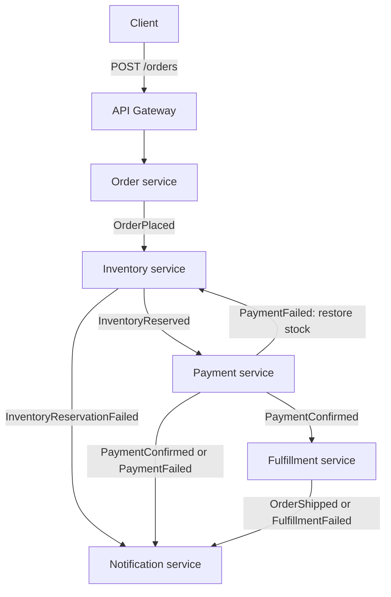

# Order Fulfillment System

This is an event-driven order fulfillment system built with Python on AWS, provisioned with Terraform. It uses a choreography-based saga pattern, as there is no central orchestrator and each service reacts to events and publishes the next one in the chain. A tranasactional outbox pattern is used by leveraging DynamoDB transactions to ensure event delivery stays consistent with database writes. Idempotency is enforced with conditional DynamoDB writes, with a dedicated tracking table where a service's schema does not directly support it.

## Technologies Used

**Language**: Python  
**AWS**: Lambda, SQS with dead-letter queues, EventBridge, IAM with least-privilege per-service roles, DynamoDB with Streams and transactions, API Gateway  
**Infrastructure as Code**: Terraform  
**Testing**: Pytest, Moto

## How it works

1. A client submits an order to `POST /orders`. The order service saves the order and an `OrderPlaced` outbox entry in one DynamoDB transaction, then returns `202 Accepted` with an order ID.
2. DynamoDB Streams invokes the publisher service, which forwards outbox events to EventBridge. EventBridge routes each event to the appropriate SQS queues.
3. The Inventory service reserves all requested items in a transaction. A successfuly transaction produces an `InventoryReserved` event and if not enough stock is present for the order, an `InventoryReservationFailed` event is produced.
4. The payment service simulates a payment and produces a `PaymentConfirmed` or `PaymentFailed` event. A failed payment triggers inventory restoration and a notification.
5. A confirmed payment triggers simulated fulfillment, producing `OrderShipped` or `FulfillmentFailed`. The notification services logs the outcome as a way to simulate sending out a real notification.

 ## Workflow 

## Services

| Service | Responsibility |
| --- | --- |
| `order_service` | Accepts orders, generates an order ID and mock payment token, and atomically saves the order and its event. |
| `inventory_service` | Reserves available stock, rejects insufficient stock, and restores reserved stock after payment failure. |
| `payment_service` | Simulates payment success or failure and saves the result with its event. |
| `fulfillment_service` | Simulates shipment success or failure and saves the result with its event. |
| `notification_service` | Consumes outcome events and logs messages to simulate sending out notifications to customer. |
| `publisher_service` | Publishes DynamoDB outbox records to EventBridge and marks them as published. |

## Design Decisions and Tradeoffs

#### Choreography over orchestration
- No single service knows the full saga. Each one reacts to an event and publishes the next. There is no central place to determine where an order is. Order visibility comes from tracing across services and logs.

#### Transactional Outbox with DynamoDB transaction
- The event write happens in the same transaction as the state write. An event is only emitted if the state change gets committed. This requires an extra publisher service and the setup of DynamoDB streams to manage.

#### Idempotency via Conditional DynamoDB writes
- Each service has its own order table to track if it has seen a specific orderId. An extra table was added for Inventory service because the inventory table does not have a natural key.

#### SQS between EventBridge and Lambda
- SQS is added between EventBridge and Lambda to enable better scalability and failure observability. It buffers bursts of messages for Lambda to poll instead of receiving them all at once, and each queue has an associated dead-letter queue to catch messages that fail repeatedly. Without SQS, EventBridge could invoke Lambda directly as a target, but a failure could still result in the event being dropped unless a separate DLQ was configured on that target. The tradeoff is added latency and the operational overhead of managing a queue and DLQ per service.

#### Accepted (202) result from Order endpoint
- The client gets acknowledgement of receipt but is not aware of the final outcome. A webhook or polling would need to be introduced to alert the client of the final state.

## Known Gaps

#### Order Idempotency
- The order service currently generates a new GUID for orderId on every request. This prevents the system from truly detecting duplicate requests despite there being a corresponding Orders table in DynamoDB keyed on orderId. The fix would be to shift orderId generation to the client and have the client send the id as an idempotency-key request header. Order service can then use this key to identify if it is processing a duplicate order by checking its business table.

#### Event Routing
`Eventbridge.tf` defines rules and targets as individual resources rather than generating them from a data structure or for_each loop such as in `sqs.tf` or `lambda.tf`. Generating these rules is possible but would require introducing a new pattern in terraform to help fan-out targets for events like `payment_failed` and `payment_confirmed`. The file is left in its current format to avoid introducing new complexity as there are only 7 rules and 9 targets. The routing logic is also duplicated. A target added in `eventbridge.tf` also needs a matching entry in `sqs.tf`'s `allowed_queue_rules` map. If it's missed, `terraform plan` and `terraform apply` both succeed with no warning, and the failure only surfaces later as FailedInvocations on the rule, which will rely on someone knowing where to look to find it.

#### Lambda and Code Structure
- Each lambda contains all the code needed to complete its role in the Saga. Tracking data classes and model shapes across lambdas can slow down development as there is a need to confirm the shapes between services. Ideally, all models and helper functions that are reused would be placed in a shared folder and referenced by the lambda functions. This would require a change to how the lambdas are packaged since the lambda packages currently includes just their own .py file.

#### Batching
